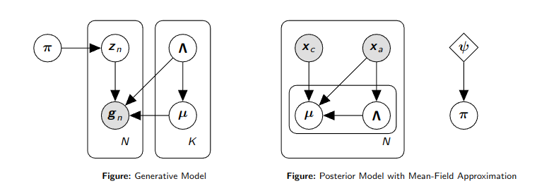
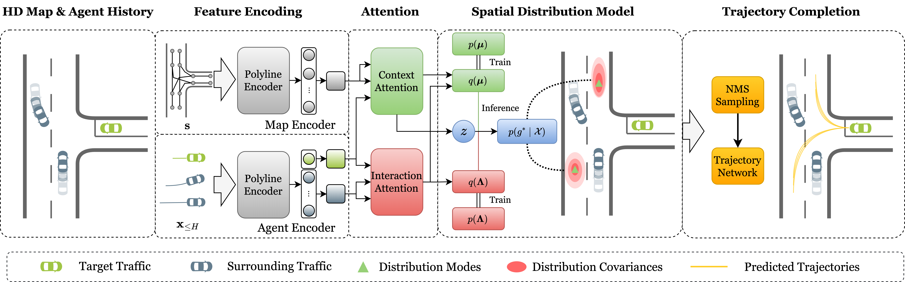
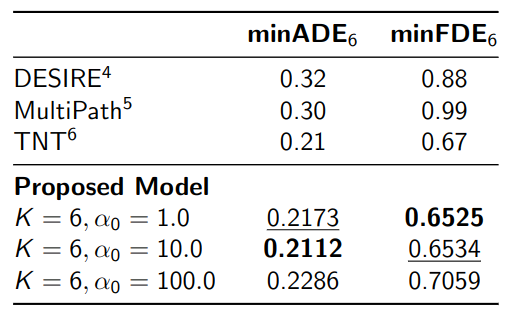
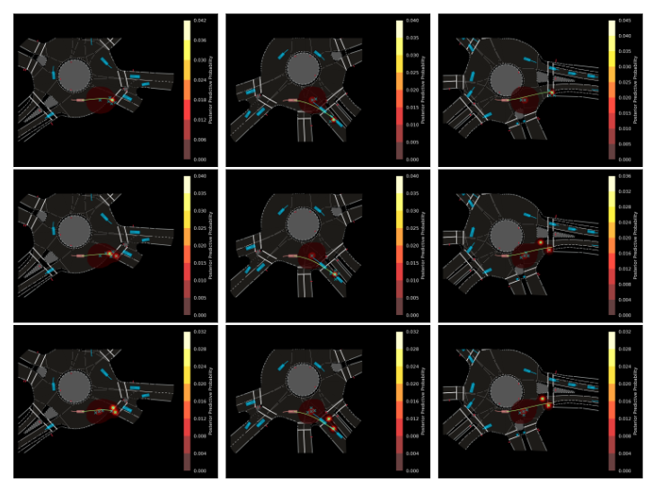

# Learning Stochastic Driver Behavior: A variational inference approach

 \

This repository is the official implementation of the course project for Purdue University ECE69500: Inference & Learning in Generative Models.

**Author:** Juanwu Lu

## Introduction

### Motivation

Motion prediction in autonomous vehicles (AVs) tries to estimate the future motion states of other traffic participants for a certain perior based on historical observation about their surroundings. To build a valid and robust motion prediction model, this project considers three key questions:

- _How can we capture the high degrees of future uncertainty?_
- _How can we model the multimodal distribution of future trajectories?_
- _How can we incorporate interpretable latent variables in the model?_

### Design Ideas

To address the above questions, this project make use of two key observations:

1. **Cumulative Uncertainty**: The destination of a future trajectory accounts for most uncertainty due to cumulative uncertainty over time.
2. **Hierarchical Decision Process**: Drivers usually first decide where to go and then adjust their maneuvers to reach the destination along the way.

Therefore, the proposed model follows a **target-driven motion prediction** paradigm, which reduces the motion prediction problem into a **two-stage** generation problem: first, sample and generate plausible trajectory endpoints from a destination distribution, and then complete the intermediate trajectories from the current location to these sampled locations.

### Destination Distribution

The desitation $g$ is assumed to follow a **Bayeisan Mixutre of Gaussian distributions** as illustrated by the figures below. In the generative model, observed destination is assumed to be drawn from a predefined mixture of $K$ Gaussian distributions, with unobserved label $\\boldsymbol{z}$.

However, surrounding information applies critical constraints over the destination distributions. For example, information about road geometry in $\\boldsymbol{x}\_c$ can affect the locations of distribution means, and history movements of other participants in $\\boldsymbol{x}\_a$ can affect the belief/uncertainty of a distribution. Therefore, in the posterior model, neural networks are used to learn mapping from input $\\boldsymbol{x}\_c$ and $\\boldsymbol{x}\_a$ to the parameters in posterior distributions of $\\boldsymbol\\mu$ and $\\boldsymbol\\Lambda$. Meanwhile, there is an additional set of learnable parameters $\\psi$ for the posterior Dirichlet distribution.

By formulating the model in this way, one can directly sample from the posterior predictive distribution of destination for prediction, in the form,
$$
p(\\boldsymbol{g}\\mid\\boldsymbol{x}_c,\\boldsymbol{x}_a)\\approx\\frac{1}{\\hat{\\alpha}}\\sum\\limits_{k=1}^K\\alpha_k^\\prime(\\psi)\\text{StudentT}_{\\nu^\\prime-D+1}\\left(\\boldsymbol{g}\\mid\\eta_k^\\prime(\\boldsymbol{x}\_c,\\boldsymbol{x}\_a),\\frac{\\beta_k^\\prime+1}{\\beta_k^\\prime(\\nu_k^\\prime-D+1)}W^\\prime_k(\\boldsymbol{x}_a)\\right),
$$
where $\\alpha_k^\\prime$ is parameterized by $\\psi$, $\\hat{\\alpha}=\\sum_{k=1}^K\\alpha^\\prime_k$, $\\beta_k^\\prime$ and $\\nu_k^\\prime$ are input-independent, learnable parameters in the posterior distributions, and $\\eta_k^\\prime$ and $W_k^\\prime$ are outputs from neural networks.

### Neural Network Framework

Following the existing works, a traffic scenario is represented as a collection of polylines, consisting of,

- **Road Geometry:** polylines associated with road boundaries, lane markings, etc..
- **History Trajectories:** polylines representing the history trajectories of surrounding traffic

The model uses two separate polyline encoder, each a PointNet with max-pooling aggregation, to encode the vector representation for each polyline. The two global attention blocks uses polyline feature of the target participant as the query, and the feature of the rest polylines as key and value, and output the parameters in posterior distributions as mentioned in the previous sections.

For sampling, the model first generate a huge number of dense candidates, and then apply Non-Maximum Suppression (NMS) to select the top-$k$ destinations with the highest probabilities on the posterior predictive distribution. A consecutive Long-short-term Memory (LSTM) network uses sampled destination and history trajectory features as input and initial hidden state, and outputs the full trajectory.

### Results

- Benchmark performance with existing works

  

- Visualizations of destination posterior predictive distributions. (Each row is the visualization with the same prior $\\alpha_0$ under three different cases, and the prior $\\alpha_0$ for each row are $1.0$, $10.0$, and $100.0$, respectively)

  

## Getting started
